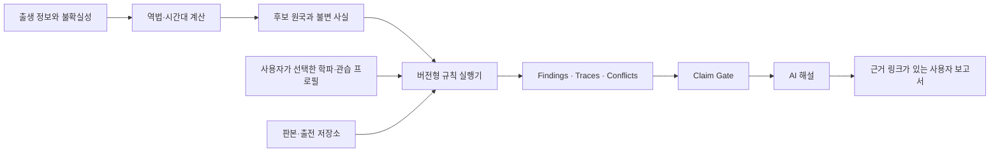

# 한국 사주 서비스의 학파별 규칙층 연구와 구현 설계

> 역사적 조사 문서입니다. 이 문서 후반의 의미 기반 고위험 주제 차단 권고는 v0.6.0
> ADR 0004로 대체되었습니다. 현재 런타임은 해석 주제를 차단하지 않으며, 학파 finding
> 근거와 후보 불확실성을 연결한 provider 작성 해설을 반환합니다.

> 상태: 구현 전 연구·설계 기준서
> 작성일: 2026-07-28
> 대상: 이 저장소의 계산 코어, Oh My Saju Tradition Pack 규칙층, Reading/Application
> 런타임
> 범위: 전통 규칙을 재현 가능하게 계산하고 비교하는 방법. 전통 명리의 예측 효능을 과학적으로 입증하는 문서가 아니다.

## 1. 결론

완전한 서비스로 확장하려면 하나의 “정답 사주 알고리즘”을 만들면 안 된다. 다음 세 계층을 분리해야 한다.

1. **관측·역법 계층**은 출생 시각, 위치, 시간대, 절기와 간지처럼 검증 가능한 사실을 계산한다.
2. **규칙 프로필 계층**은 격국, 신강·신약, 용신, 신살처럼 문헌·저자·현대 유파마다 달라지는 규칙을 명시적으로 선택해 실행한다.
3. **AI 해설 계층**은 계산 결과와 규칙 추론의 근거만 설명한다. AI가 간지를 다시 계산하거나, 학파를 몰래 섞거나, 근거 없는 사건을 만들어서는 안 된다.

따라서 서비스가 제공할 수 있는 “완전함”은 모든 사람의 운명을 단정하는 완전함이 아니라 다음을 만족하는 **계산·근거·불확실성의 완전함**이어야 한다.

- 동일 입력과 동일 프로필이면 동일 결과가 나온다.
- 모든 결과에 적용한 규칙, 판본·문헌 위치, 입력 사실을 추적할 수 있다.
- 서로 다른 규칙은 하나로 평균내지 않고 병렬 결과와 충돌 이유를 보여 준다.
- 출생 시간이 불확실하면 후보 원국 전체를 계산하고, 후보에 공통인 결론과 갈리는 결론을 구분한다.
- 전통적 해석과 경험적으로 검증된 사실을 혼동하지 않는다.

이 문서에서 “학파”는 회원·교단처럼 경계가 고정된 조직을 뜻하지 않는다. 실제 명리 문헌은 시대, 저자, 주석자, 판본, 후대 종합 방식이 겹친다. 구현 단위는 모호한 `전통 명리`나 `한국식`이 아니라 **출전이 특정된 규칙 프로필(source-lineage rule profile)** 이어야 한다.

---

## 2. 근거의 등급과 서비스 경계

### 2.1 다섯 개의 계산·해석 층

| 층                | 내용                                    | 예                                                | 성격               |
| ----------------- | --------------------------------------- | ------------------------------------------------- | ------------------ |
| L0 입력 증거      | 사용자가 실제로 아는 정보와 그 불확실성 | 양력 생년월일, “오전”, 출생지 미상                | 관측·진술          |
| L1 역법 사실      | 시간대·천문·간지에서 직접 계산          | UTC instant, 절입 순간, 사주 원국 후보            | 검증 가능한 계산   |
| L2 관습 의존 계산 | 정책을 고르면 결정적으로 계산           | 야자시, 진태양시, 지장간표, 십이운성표, 대운 기산 | 프로필 의존 계산   |
| L3 명리 교리      | 문헌의 분류·우선순위·예외 규칙          | 격국, 신강약, 용희기신, 합화 성립, 신살 의미      | 출전이 필요한 추론 |
| L4 서술           | L1~L3 결과를 사람이 읽기 쉽게 표현      | “이 프로필에서는 두 후보가 갈립니다”              | AI 표현 계층       |

L1은 단일 엔진의 핵심이 될 수 있다. L2와 L3은 반드시 프로필 ID와 버전을 가져야 한다. L4는 새로운 명리 사실을 생성할 권한이 없다.

### 2.2 구현 가능성 등급

- **A — 핵심 결정 계산**: 하나의 공개된 수학·역법 규칙으로 계산하고 독립 구현과 대조할 수 있다.
- **B — 프로필 결정 계산**: 정책 또는 표를 명시하면 결정적으로 계산할 수 있다.
- **C — 출전 기반 교리 추론**: 규칙을 코드화할 수 있지만 우선순위·예외·용어가 유파마다 다르다. 후보·충돌 반환이 필요하다.
- **D — 서술·주장 영역**: 성격, 사건, 길흉 단정 등 계산 결과로 검증되지 않는 내용이다. 사실처럼 출력하지 않는다.

등급은 “전통에서 중요하지 않다”는 평가가 아니다. 소프트웨어가 단일 정답처럼 제공해도 되는지를 뜻한다.

---

## 3. 역법과 시간의 신뢰 기반

### 3.1 시간대

[IANA Time Zone Database](https://www.iana.org/time-zones)는 지역별 UTC 오프셋과 일광절약시간의 변천을 기록하며 계속 갱신된다. 운영 엔진은 `Asia/Seoul`을 단순 `UTC+09:00` 상수로 바꾸면 안 되고, tzdb 버전을 결과에 남겨야 한다.

IANA의 [Theory 문서](https://www.iana.org/time-zones/theory)는 특히 1970년 이전 지역 시각 자료가 불완전할 수 있음을 설명한다. 따라서 1961년 이전 한국 출생도 계산 불가능한 것은 아니지만 다음처럼 다뤄야 한다.

- 역사적 오프셋은 해당 tzdb 버전의 `Asia/Seoul` 이력으로 환산한다.
- 사용자가 기억하는 시간이 표준시인지, 병원 기록인지, 음력 날짜의 구두 기억인지 입력 증거를 구분한다.
- 출생지·시각이 경계에 가깝고 역사 자료가 불확실하면 하나의 시주를 강제하지 않는다.
- 결과에는 `tzdbVersion`, 적용 오프셋, 원시 현지시각, UTC instant를 모두 보존한다.
- tzdb의 초기 자료와 별개로 역사적 민간 기록을 임의 보정하지 않는다. 보정이 필요하면 별도 데이터 프로필과 출전을 둔다.

현재 IANA 공개 페이지 기준 최신 tzdb는 2026-07-08 공개된 `2026c`이지만, 라이브러리 결과의 재현성을 위해 서비스 배포물이 실제로 사용한 버전을 기록해야 한다.

### 3.2 역법과 절기

한국천문연구원이 공공데이터포털로 제공하는 [음양력 정보 API](https://www.data.go.kr/dataset/15012679/openapi.do)는 양력·음력·율리우스일 등 한국 서비스의 외부 검증 기준으로 사용할 수 있다. 다만 API 응답을 런타임 단일 의존점으로 만들기보다는 고정된 검증 fixture와 회귀 테스트의 권위 데이터로 쓰는 편이 안정적이다.

[Time4J `SolarTerm`](https://time4j.net/javadoc-en/net/time4j/calendar/SolarTerm.html)은 24절기를 태양 황경으로 모델링하며 입춘을 315도로 정의한다. [Time4J `KoreanCalendar`](https://time4j.net/javadoc-en/index-all.html)는 한국 달력 계산을 제공하고 문서상 지원 범위가 양력 1645-01-28부터 3000-01-27까지다. 프로젝트가 이보다 이전을 지원한다면 “같은 품질의 공식 지원”으로 표시해서는 안 되며 별도 역법 구현·검증 범위가 필요하다. Time4J의 배포 정보와 라이선스는 [Maven Central](https://central.sonatype.com/artifact/net.time4j/time4j-parent)에서 확인할 수 있다.

중국 오픈소스 Tyme의 [공식 문서](https://6tail.cn/tyme.html)는 팔자 제공자(provider)를 바꿔 23시 일주 정책을 달리하는 예를 제공한다. 이는 **정책 주입 구조의 좋은 선례**이지 한국 명리 교리의 권위 근거는 아니다.

### 3.3 경계에서 단일 결과를 강제하지 않는 원칙

다음 입력은 후보 결과를 만들어야 한다.

- 시간 모름: 연주·월주·일주만 확정하고 시주 없이 삼주 반환
- 오전/오후만 앎: 가능한 시진 후보를 모두 반환
- 23시 전후 추정: `civil-midnight`, `late-zi-starts-day`, 기타 지원 정책을 병렬 비교
- 절입 시각 부근: 절입 전후 월주 후보를 반환
- 역사적 표준시 변경 또는 DST 경계: 적용 가능한 instant 후보를 반환
- 출생지 미상이며 진태양시를 요구하는 프로필: 계산 불가 사유를 반환

임의로 정오를 넣어 완전한 네 기둥처럼 보이게 하는 것은 금지한다.

---

## 4. 문헌 계보와 “학파 차이”의 실제 원인

### 4.1 주요 원전·주석 계열

#### 《三命通會》

[Chinese Text Project의 《三命通會》](https://ctext.org/wiki.pl?if=en&res=532360)는 명대 萬民英의 종합 문헌을 四庫全書 계열 저본으로 제공한다. 제2권에는 지장간·절기·십이운성·간합·지지 관계·대운법이, 제3권에는 여러 신살이, 제5권에는 일간을 기준으로 한 십신·격국 논의가 나타난다.

- [제2권](https://ctext.org/wiki.pl?chapter=17423&if=en): 인원사령, 오행 왕상휴수, 십이운성, 천간합, 지지 합·형·충·해
- [대운 기산 대목](https://ctext.org/wiki.pl?chapter=578162&if=gb): 양남·음녀 순행, 음남·양녀 역행 및 3일을 1년으로 환산하는 전통식
- [제3권의 신살 사례](https://ctext.org/wiki.pl?chapter=868825&if=en): 천을귀인조차 계산·설명 변형이 함께 전승됨
- [공망·역마 관련 대목](https://ctext.org/wiki.pl?chapter=117077&if=en): 신살이 존재한다는 이유만으로 자동 길흉이 되지 않고 배치와 조건을 함께 본다는 사례
- [제5권](https://ctext.org/wiki.pl?chapter=864968&if=gb): 일주 천간과 생극·음양을 토대로 한 십신 및 재관인식 등의 구조
- [제6권](https://ctext.org/wiki.pl?chapter=170412&if=en): 같은 팔자라도 실제 삶이 달랐다는 사례가 실려 있어, 원전 내부에서도 단순 결정론의 한계가 드러남
- [제7권](https://ctext.org/wiki.pl?chapter=548506&if=gb): 시대에 따른 논법 변화와 월령·일주 중심 논의

CText 페이지는 OCR 초고임을 명시한다. 규칙표를 제품에 넣을 때는 [국립도서관 소장본 스캔의 공개 사본](https://upload.wikimedia.org/wikipedia/commons/2/23/NLC416-13jh000156-94145_%E4%B8%89%E5%91%BD%E9%80%9A%E6%9C%83.pdf) 같은 판면 이미지로 원문을 대조하고, 권·면·행 또는 이미지 번호를 기록해야 한다.

#### 《子平真詮》과 후대 평주

[《子平真詮評注》](https://ctext.org/wiki.pl?chapter=974137&if=en)는 월령에서 용신을 구하고 일간과 월지의 생극 관계로 격국을 나누는 계열을 잘 보여 준다. 다만 제품 규칙으로 옮길 때 원저 沈孝瞻의 층과 후대 徐樂吾 평주의 층을 구분해야 한다. 같은 웹 문서에 있다는 이유로 모두 원저자의 단일 체계로 취급하면 안 된다.

이 계열에서 `用神`은 흔히 **월령과 격국을 조직하는 중심**이라는 의미로 사용된다. 현대의 “부족한 오행을 채우는 유리한 원소”와 동일하지 않다. 이 용어 차이는 API 설계에서 가장 먼저 분리해야 할 사항이다.

월령을 중시하더라도 득령만으로 기계적으로 왕쇠를 끝내지 않는 논지는 [비주석 장절 공개본](https://www.donglishuzhai.net/chapter/3719.html)에서도 확인된다. 이 공개본은 보조 탐색 자료로만 사용하고 제품 규칙의 인용은 판본 검증 뒤 확정해야 한다.

#### 《滴天髓闡微》

[《滴天髓闡微》](https://ctext.org/wiki.pl?chapter=826601&if=en)는 왕쇠, 흐름, 종격·특수 구조 등을 정량 점수 하나보다 전체 관계와 극단 상태로 논한다. “강하면 무조건 억제, 약하면 무조건 보강” 같은 단일 산술식으로 축약할 수 없는 예외 논리가 있다. 여기서도 본문과 任鐵樵 주석의 텍스트 층을 분리해야 한다.

#### 《窮通寶鑑》

[《窮通寶鑑》](https://ctext.org/wiki.pl?chapter=208379&if=en)은 일간과 월령의 계절·한난조습을 중심으로 필요한 천간·오행을 논한다. 이는 `調候用神`을 격국용신이나 억부용신과 별도 모듈로 구현해야 하는 직접적인 이유다.

### 4.2 한국 학술 연구가 확인하는 차이

한국 연구는 “현대 한국 명리”도 하나의 균일한 규칙이 아님을 보여 준다.

- 송지성의 [《命理正宗》 연구](https://www.dbpia.co.kr/journal/detail?nodeId=T13373855)는 고전과 현대 논법이 음양, 십이운성, 격국 개념에서 달라지고, 고전의 격국·용신 결합과 현대의 신강약·억부 중심 분리가 다름을 정리한다. 일부 현대 논법은 음간의 역행 십이운성을 부정하기도 한다.
- 박나현의 [《命理約言》 연구](https://www.dbpia.co.kr/journal/detail?nodeId=T14205407)는 격국·용신 논법이 전대 문헌과 달라지고 후대 명리에 영향을 준 과정을 다룬다.
- 이수동의 [육친론 근원 연구](https://www.dbpia.co.kr/journal/articleDetail?nodeId=NODE10672624)는 일간을 기준으로 생극과 음양을 배치하는 십신 체계의 문헌적 형성을 추적한다.
- 최원호 등의 [인원용사 연원 연구](https://kiss.kstudy.com/Detail/Ar?key=4073149)는 월지 지장간의 용사 일수가 고전마다 다르고, 월지에서 투간된 글자를 취하는 방법과도 충돌할 수 있음을 지적한다.
- 강성인의 [인원 연구](https://kiss.kstudy.com/DetailOa/Ar?key=51760126)는 지장간 구성과 생지·왕지·고지 등의 분류 배경을 다룬다.
- 김만태의 [지지 충·형 연구](https://www.accesson.kr/ksq/assets/pdf/40880/journal-36-3-134.pdf)는 충·형의 고전적 근거와 해석 변화를 비교한다. 辰戌丑未 충을 “창고가 열림”으로 볼지 내부 기운의 손상으로 볼지 문헌이 갈리고, 합은 항상 좋고 충·형은 항상 나쁘다는 도식도 성립하지 않음을 보여 준다. [KCI 서지 페이지](https://www.kci.go.kr/kciportal/landing/article.kci?arti_id=ART001802048)도 함께 보존한다.
- 2026년의 [《命理正宗》과 《子平真詮》 패러다임 비교 연구](https://www.kci.go.kr/kciportal/ci/sereArticleSearch/ciSereArtiView.kci?sereArticleSearchBean.artiId=ART003302983)는 후자가 월령 중심의 격국 성패·구응을 우선하고 신살을 격국 판단에서 배제하는 차이를 논한다.
- 이창임의 [궁합 연구](https://www.dbpia.co.kr/journal/detail?nodeId=T14205410)는 연주·납음·구궁 중심의 이전 방법과 일주·궁위·십신·용신을 사용하는 자평 계열 방법을 구분한다.

이 자료들은 전통 이론의 역사와 내부 차이를 연구한 근거다. 특정 규칙의 미래 예측력이 실증되었다는 근거로 사용하면 안 된다.

### 4.3 규칙이 갈리는 일곱 이유

1. **역사적 중심축 변화**: 연주·납음 중심 방법에서 일간 중심 자평법으로 강조점이 이동했다.
2. **같은 용어의 의미 변화**: 특히 용신은 격국의 작용점, 균형 오행, 조후 요소, 통관 요소 등으로 쓰인다.
3. **본문과 주석의 혼합**: 후대 주석자의 체계를 원저자의 체계처럼 읽기 쉽다.
4. **기초 표 자체의 차이**: 지장간 용사 일수, 일부 신살표, 음간 십이운성 진행처럼 표가 다르다.
5. **우선순위 차이**: 월령 격국, 왕쇠 억부, 한난조습, 병약, 통관 중 무엇을 먼저 보는지가 다르다.
6. **성립 조건과 예외 차이**: 합이 있어도 화하지 않는 경우, 충이 있어도 실제 작용이 약한 경우, 종격 인정 범위가 다르다.
7. **현대 종합의 혼합**: 서로 다른 문헌의 규칙을 편의상 합쳐 사용하면서 출전 경계가 사라진 경우가 많다.

---

## 5. 항목별 구현 연구

### 5.1 십신과 육친

십신의 원시 관계는 일간과 대상 천간의 오행 생극 방향, 음양 동일·상이 여부로 계산할 수 있다. 이 부분은 거의 전수 검사가 가능한 B급 계산이다.

구현 결과는 최소한 다음을 분리한다.

- `tenGodRelation`: 비견·겁재·식신·상관·편재·정재·편관·정관·편인·정인
- `subject`: 어떤 일간을 기준으로 했는지
- `target`: 표면 천간인지, 지장간인지, 운의 천간인지
- `polarityRelation`과 `elementRelation`: 결과를 만든 원시 관계
- `familyRoleInterpretation`: 별도 교리 팩. 현대 가족관계에 자동 대입하지 않음
- `personalityNarrative`: L4 서술. 계산 결과로 취급하지 않음

테스트는 10개 일간 × 10개 대상 천간의 100쌍을 모두 고정 fixture로 검증한다.

### 5.2 지장간과 인원용사

지장간은 두 문제를 분리해야 한다.

1. 각 지지에 어떤 천간이 저장된 것으로 보는가.
2. 월중 어느 기간에 어느 지장간이 사령한다고 보는가.

첫 번째는 명시된 표를 고르면 B급이다. 두 번째는 고전별 일수 배정과 적용 논리가 달라 C급이다. 따라서 `지장간 = 60/30/10%` 같은 가중치는 전통적 사실로 저장하면 안 된다.

현재 엔진의 `0.6/0.3/0.1` 정규화가 시각화용 합성 지표라면 다음을 반드시 표시해야 한다.

- `status: synthetic`
- `purpose: visualization-only`
- 신강약, 격국, 용신 판정의 근거로 자동 승격하지 않음
- 역사적 인원용사표와 이름·타입을 공유하지 않음

권장 모델:

```ts
type HiddenStemMembership = {
  branch: EarthlyBranch;
  stems: Array<{
    stem: HeavenlyStem;
    roleLabel?: 'main' | 'middle' | 'residual';
  }>;
  tableProfile: RuleProfileRef;
};

type HiddenStemGovernance = {
  instant: Temporal.Instant;
  monthBranch: EarthlyBranch;
  governingCandidates: Array<{
    stem: HeavenlyStem;
    interval: TimeInterval;
    sourceRuleId: RuleId;
  }>;
};
```

### 5.3 천간·지지의 합충형파해와 원진

**관계의 존재 탐지**와 **관계가 성립·발동·변화했다는 평가**를 분리해야 한다.

예를 들어 지지 두 글자가 충쌍에 해당하는지는 B급 표 계산이다. 그 충이 강한지, 창고를 여는지, 지장간을 손상시키는지, 어떤 사건을 뜻하는지는 C~D급이다. 천간합·지지합도 마찬가지로 “쌍이 있다”와 “합화가 성립해 원래 오행이 변했다”를 같은 Boolean으로 표현하면 안 된다.

권장 단계:

1. `match`: 원국·운에서 관계표에 맞는 글자 집합 탐지
2. `eligibility`: 월령, 투간, 방해 관계 등 해당 프로필의 성립 조건 평가
3. `activation`: 원국 내부인지, 운에서 촉발됐는지 구분
4. `transformationCandidate`: 합화 후보와 성립·불성립 근거 반환
5. `evaluation`: 해당 문헌 프로필의 길흉·구조 해석
6. `narrative`: AI가 위 근거를 제한적으로 설명

원국 오행을 합화 후보 때문에 파괴적으로 덮어쓰지 않는다. 원시 명식은 불변으로 두고, 변환된 관점은 파생 그래프로 만든다.

지원할 관계:

- 천간 오합·충 관계
- 지지 육합·삼합·방합
- 지지 육충
- 형
- 파
- 해
- 원진

한국에서 말하는 `怨嗔` 관계와 고전 신살인 `元辰`은 한자·용례를 명시해 서로 다른 rule ID로 둔다. 김만태의 연구처럼 원진은 충의 앞뒤 관계에서 설명되기도 하지만, 이를 보편적 감정·궁합 점수로 곧장 바꾸지 않는다.

### 5.4 십이운성

십이운성의 순환표는 프로필을 고르면 B급이다. 쟁점은 다음과 같다.

- 양간과 음간을 모두 같은 방향으로 돌릴지, `양생음사`에 따라 음간을 역행시킬지
- 토간의 장생 위치와 오행 귀속을 어떻게 둘지
- 일간 외에 연간·다른 천간에도 적용할지
- 운성 명칭을 실제 생애 단계나 강도 점수로 해석할지

원시 출력은 `장생/목욕/.../양`의 단계와 사용한 표만 반환한다. `제왕 = 무조건 강함`, `묘 = 무조건 나쁨` 같은 의미 부여는 별도 C급 규칙이다.

```ts
type GrowthStageProfile = {
  profileId: string;
  yinStemDirection: 'reverse' | 'same-as-yang';
  earthStemMapping: 'follows-fire' | 'own-table' | string;
  allowedSubjects: Array<'dayStem' | 'yearStem' | 'allVisibleStems'>;
  stageTable: Record<HeavenlyStem, Record<EarthlyBranch, GrowthStage>>;
};
```

### 5.5 공망

60갑자의 순(旬)에서 빠지는 두 지지를 구하는 계산은 A급에 가깝다. 다만 무엇을 기준으로 공망을 잡는지와 공망의 효과는 분리해야 한다.

- `anchor: dayPillar | yearPillar | transitPillar`
- `voidBranches`: 계산된 두 지지
- `targetOccurrence`: 어느 궁·지지·운에서 만나는지
- `effect`: 별도 규칙

《三命通會》의 공망 대목도 공망을 자동 흉으로만 취급하지 않는다. “공망이면 해당 기능이 완전히 사라진다”는 단일 규칙은 허용하지 않는다.

### 5.6 신강·신약

신강약은 요소 개수를 세는 하나의 공식이 아니다. 월령, 통근, 투간, 생조·설기·극제, 합화, 인원사령, 특수격 인정 여부를 어떤 순서로 보는지가 프로필마다 다르다.

엔진은 우선 **증거 벡터**를 계산해야 한다.

```ts
type StrengthEvidence = {
  seasonalCommand: EvidenceItem[];
  roots: EvidenceItem[];
  visibleSupport: EvidenceItem[];
  hiddenSupport: EvidenceItem[];
  drainingRelations: EvidenceItem[];
  controllingRelations: EvidenceItem[];
  competingTransformations: EvidenceItem[];
  specialPatternCandidates: EvidenceItem[];
};
```

그 다음 프로필이 `very-strong | strong | balanced | weak | very-weak | follow-candidate | indeterminate` 같은 분류 후보를 근거와 함께 반환한다.

금지 사항:

- 현재의 오행 백분율을 신강 점수로 재사용
- “목 27%, 수 18%이므로 신강”처럼 역사적 근거가 없는 임계값 사용
- 서로 다른 유파의 득령 점수·지장간 점수·합화 규칙을 한 합산표에 혼합
- 경계 사례에 거짓 정밀도(`신강 73.2%`) 부여

원한다면 현대 합성 점수 프로필을 별도로 만들 수 있으나 `status: synthetic-modern`과 학습·검증 데이터의 부재를 명시해야 한다.

### 5.7 격국

격국은 특히 프로필 의존적인 C급 모듈이다.

월령 중심 프로필의 안전한 계산 순서는 다음과 같다.

1. 월지와 그 지장간·사령 후보를 확정
2. 월지 지장간의 투출 여부 탐지
3. 일간과 월령의 십신 관계로 정격 후보 생성
4. 천간 투출·지지 회합에 따른 변격 후보 생성
5. 격의 성립, 파격, 구응 조건을 각각 평가
6. 종격·전왕격 등 특수격 후보는 별도 규칙집으로 평가
7. 후보가 여러 개면 우선순위 규칙과 탈락 이유를 함께 반환

`格局`을 단순히 “직업 유형”이나 “성격 라벨”로 출력하지 않는다. 먼저 구조 분류로 보존한다.

```ts
type PatternFinding = {
  candidates: Array<{
    patternId: string;
    confidenceClass: 'established' | 'candidate' | 'defeated';
    establishedBy: RuleTrace[];
    defeatedBy: RuleTrace[];
    rescueConditions: RuleTrace[];
  }>;
  selected?: string;
  selectionRule?: RuleId;
};
```

### 5.8 용신·희신·기신

서비스는 단일 필드 `yongShin: "목"`을 제공하면 안 된다. 먼저 방법을 이름으로 구분해야 한다.

| 필드                     | 의미                                  | 대표적 중점          |
| ------------------------ | ------------------------------------- | -------------------- |
| `structureUsefulGod`     | 격국의 성립·운용 중심                 | 월령·격국, 성패·구응 |
| `balancingUsefulElement` | 왕쇠 억부를 위한 요소                 | 신강약, 생조·설극    |
| `climateUsefulElement`   | 한난조습 조절 요소                    | 계절·조후            |
| `bridgingUsefulElement`  | 상극 사이의 흐름을 통하게 하는 요소   | 통관                 |
| `illnessMedicineElement` | 명식의 병을 특정하고 약을 취하는 방식 | 병약                 |
| `followPatternElement`   | 종격·특수격의 기세를 따르는 요소      | 종왕·종강 등         |

희신·기신도 “좋은 원소/나쁜 원소”의 전역 상수가 아니라 선택한 방법과 조건에 종속된다.

```ts
type UsefulGodFinding = {
  method: 'structure' | 'balance' | 'climate' | 'bridging' | 'illness-medicine' | 'follow';
  candidates: ElementOrStemCandidate[];
  rejectedCandidates: RejectedCandidate[];
  prerequisites: FindingRef[];
  profileRef: RuleProfileRef;
  status: 'selected' | 'multiple-candidates' | 'indeterminate';
};
```

서로 다른 방법의 결과가 같으면 “학파 간 합의”로 표시할 수 있지만 하나로 병합하지 않는다. 다르면 어느 쪽이 진짜인지 AI가 임의 결정하지 않고 나란히 보여 준다.

### 5.9 대운

《三命通會》 계열에서 확인되는 대표 규칙은 연간 음양과 전통적 남녀 구분을 이용해 순·역행을 정하고, 순행은 다음 절까지, 역행은 이전 절까지의 시간을 재어 3일을 1년으로 환산하는 방식이다. 그러나 현대 구현에는 다음 모든 정책을 선언해야 한다.

```ts
type MajorLuckPolicy = {
  directionBasis: 'year-stem-yang-male-yin-female-forward' | 'day-stem' | 'explicit';
  traditionalSexParameter?: 'male' | 'female';
  explicitDirection?: 'forward' | 'backward';
  boundarySet: 'jie-only' | 'all-solar-terms';
  intervalAnchor: 'previous-boundary' | 'next-boundary';
  conversion: 'three-days-per-year';
  subDayConversion: 'hours-to-months-days' | 'fractional-year';
  rounding: 'exact' | 'floor' | 'nearest' | 'traditional-display';
  firstPillar: 'next-from-month' | 'current-month' | string;
  ageDisplay: 'elapsed-age' | 'korean-reckoning' | 'both';
};
```

전통 규칙의 `남/녀` 매개변수는 현대의 성정체성 추론과 동일하지 않다. 사용자가 직접 전통 계산 매개변수를 선택하거나, 방향을 명시할 수 있어야 한다. 서비스가 이름이나 주민번호로 성별을 추정하면 안 된다.

대운은 다음을 별도 출력한다.

- 순·역행과 그 근거
- 절입까지 실제 duration
- 기운 시작의 정확한 나이와 양력 instant
- 표시용 반올림 나이
- 대운 간지열
- 출생시간 후보별 대운 시작 범위

일수를 3으로 나눈 뒤 반올림하고 최소 1세로 고정하는 단순 구현은 하나의 표시 정책일
뿐 보편적 정답이 아니다.

### 5.10 세운·월운

세운의 간지 자체는 경계 정책을 고르면 A/B급이다. 월운은 절입의 정확한 instant를 기준으로 계산해야 한다.

- `annualBoundary`: 입춘 instant, 음력 정월, 양력 1월 1일 등 프로필 선언
- `monthlyBoundary`: 12절의 exact instant인지 다른 관행인지 선언
- `timezoneContext`: 같은 UTC instant가 어느 지역의 날짜·시각으로 보이는지
- `transitPillars`: 계산 사실
- `interactionsWithNatal`: 탐지 결과
- `meaning`: 교리 프로필

“올해 재물이 들어온다” 또는 특정 사건 날짜를 계산 사실처럼 반환하는 기능은 제공하지 않는다. 운의 글자와 원국 사이의 관계를 탐지하고, 전통 프로필이 말하는 조건부 의미를 출전과 함께 설명하는 데 그친다.

### 5.11 신살

신살은 표가 많고 같은 이름도 기준 글자·주야·절기·성별 등 변형이 있다. 《三命通會》의 천을귀인 대목 자체가 여러 설명을 함께 전한다. 그러므로 거대한 무출전 신살 사전을 한 번에 넣으면 유지보수할 수 없다.

각 신살 규칙은 다음을 가져야 한다.

```ts
type ShenShaRule = {
  ruleId: string;
  canonicalName: string;
  aliases: string[];
  anchor: 'day-stem' | 'year-stem' | 'day-branch' | 'year-branch' | 'month-branch' | 'pillar';
  target: 'branch' | 'stem' | 'pillar';
  lookupTable: Readonly<Record<string, readonly string[]>>;
  qualifiers: PredicateRef[];
  sourceRefs: SourceRef[];
  variantGroup?: string;
};
```

권장 순서:

1. 출전과 표가 검증된 소수 신살만 `raw match`로 구현
2. 같은 이름의 변형은 variant로 병렬 제공
3. 존재 탐지와 길흉 평가 분리
4. 격국 중심 프로필이 신살을 배제한다면 그 우선순위를 존중
5. “좋은 신살 개수 - 나쁜 신살 개수” 점수 금지

### 5.12 궁합

궁합은 단일 0~100 점수로 환원할 근거가 없다. 역사적으로 연주·납음·구궁을 보는 방법과 일간·일지·궁위·십신·용신을 보는 자평식 방법이 공존한다. 어느 방법을 쓰는지 먼저 선택해야 한다.

권장 출력:

- 두 사람의 확정·후보 원국 범위
- 천간·지지 관계의 대칭적 구조 탐지
- A를 기준으로 B를 본 십신과 B를 기준으로 A를 본 십신의 방향성 결과
- 각 프로필에서 중요한 보완·충돌 조건
- 출생시간 후보에 공통인 안정 결과와 후보별로 달라지는 결과
- 서로 다른 궁합 프로필 간의 합의·충돌

금지 또는 L4 제한:

- 이혼 확률, 외도 확률, 수명, 임신 여부
- 상대방의 성격·도덕성 단정
- 혼인 여부를 결정하는 단일 점수
- 전통적 성 역할을 현대 관계의 당위로 출력

한국민족문화대백과의 [혼례 항목](https://encykorea.aks.ac.kr/Article/E0063893)은 혼례 과정에서 궁합이 문화적으로 사용된 맥락을 보여 주지만, 그것이 예측 타당성의 증거는 아니다.

### 5.13 성격과 사건 예측

성격, 직업, 건강, 재물, 결혼, 출산, 사고 같은 문장은 사주 원국에서 직접 계산되는 값이 아니다. 제공한다면 다음 제약이 필요하다.

- “사실”이나 확률이 아니라 특정 전통 프로필의 조건부 해석이라고 표시
- 근거가 된 finding ID와 반대·대안 해석을 함께 제공
- 의료·법률·금융·안전 결정을 유도하지 않음
- 정확한 사건 날짜·사망·질병·범죄·임신을 단정하지 않음
- 민감 특성, 가족관계, 성적 행동, 정신건강을 추론하지 않음
- 사용자에게 불안·의존을 유도하는 반복 확인 문구를 만들지 않음

고전 내부에도 같은 원국이 다른 실제 결과로 이어진 사례가 있다. 계산의 재현 가능성은 현실 사건 예측의 검증과 같지 않다.

---

## 6. 구현 가능성 매트릭스

| 기능             | 원시 계산               | 학파 의존부                     | 등급      | 기본 서비스 정책      | 테스트 핵심                                  |
| ---------------- | ----------------------- | ------------------------------- | --------- | --------------------- | -------------------------------------------- |
| 시간대 변환      | IANA zone → instant     | 진태양시 사용 여부              | A/B       | tzdb 버전·오프셋 노출 | 한국 역사 경계, DST, 모호·존재하지 않는 시각 |
| 태양 절기        | 황경 기반 exact instant | 어떤 절기를 연·월 경계로 쓰는지 | A/B       | Time4J + 외부 fixture | 모든 절입 ±1ms                               |
| 음양력 변환      | 역법 변환               | 윤달 입력 해석                  | A/B       | KASI 대조             | 윤달, 월말, 범위 끝                          |
| 사주 원국        | 네 기둥 후보            | 23시 일주, 진태양시             | A/B       | 후보 우선             | 자정·자시·절입 경계                          |
| 십신             | 생극·음양 관계          | 육친·성격 의미                  | A/B → C/D | 관계만 core           | 100 천간쌍 전수                              |
| 지장간           | 표에 따른 구성          | 사령 일수·가중치                | B/C       | 표 ID 필수            | 12지 전수, 경계                              |
| 오행 분포        | 표면 글자 개수          | 지장간 가중치·합화 반영         | B/C       | 원시·합성 지표 분리   | 보존성, 프로필 차이                          |
| 천간합·지지 관계 | 관계표 match            | 성립·발동·합화·길흉             | B/C       | 불변 원국 + 파생 후보 | 모든 쌍·삼합, 대칭성                         |
| 형·파·해·원진    | 관계표 match            | 강도·효과                       | B/C       | 의미 자동 부여 금지   | ordered pair와 중복                          |
| 십이운성         | 선택 표 조회            | 음간 방향·토간·의미             | B/C       | profile 필수          | 10×12 전수                                   |
| 공망             | 순(旬) 계산             | 기준주·효과                     | A/B → C   | anchor 노출           | 60갑자 전수                                  |
| 신강·신약        | 증거 벡터               | 가중·우선순위·종격              | C         | 범주·후보·trace       | 분쟁 차트 golden set                         |
| 격국             | 월령·투간 raw facts     | 정격·변격·성패·구응             | C         | 복수 후보 허용        | 프로필별 golden set                          |
| 용신             | 선행 사실               | 정의 자체가 방법별 상이         | C         | 방법별 별도 필드      | 충돌 의도 fixture                            |
| 희신·기신        | 용신의 파생 조건        | 학파·상태·운에 의존             | C         | 전역 상수 금지        | 선행결과 변경 테스트                         |
| 대운 간지열      | 월주에서 순·역 전개     | 방향·기산·반올림                | B         | 모든 정책 노출        | 절입 ±1ms, 양·음년/순·역                     |
| 세운 간지        | 연 경계에 따른 계산     | 입춘/기타 경계                  | A/B       | 경계 프로필           | 입춘 ±1ms                                    |
| 월운 간지        | 월 절입에 따른 계산     | 절/중기 선택                    | A/B       | exact instant         | 12절 ±1ms                                    |
| 운의 의미        | 원국–운 관계 match      | 사건·길흉 해석                  | C/D       | 조건부 전통 해설만    | 추론 trace, 금지문 검증                      |
| 신살 탐지        | anchor+lookup           | 표 변형·성립·의미               | B/C       | curated pack          | 표 전수, variant 비교                        |
| 궁합 구조        | 두 원국 관계            | 방법·우선순위·사회적 의미       | C         | 방법별 보고서         | 대칭/방향성, 후보 Cartesian product          |
| 종합 궁합 점수   | 임의 합산 가능          | 보편적 근거 없음                | D         | 제공하지 않음         | 스키마에 없음을 검증                         |
| 성격·사건 단정   | 계산 불가               | 서술적 전통 해석                | D         | 사실형 출력 금지      | AI citation/claim gate                       |

---

## 7. 버전형 규칙 프로필 아키텍처

### 7.1 프로필을 세 종류로 나눈다

1. **Calculation Convention Profile**
   야자시, 절기 경계, 진태양시, 대운 기산, 음간 십이운성처럼 규칙을 고르면 결정되는 계산.

2. **Doctrine Profile**
   격국, 신강약, 용신처럼 출전·우선순위·예외가 필요한 추론.

3. **Overlay Pack**
   신살, 궁합처럼 여러 본체 프로필에 선택적으로 붙일 수 있지만 호환성을 검사해야 하는 규칙집.

예시 ID는 실제 구현 전에 판본과 규칙을 검증한 뒤 확정한다.

```text
calculation/korea-civil-time@1.0.0
calculation/late-zi-day-boundary@1.0.0
luck/sanming-jie-three-days@1.0.0
doctrine/ziping-month-command-shen-xiaozhan@1.0.0
doctrine/ditiansui-flow-ren-tieqiao@1.0.0
doctrine/qiongtong-seasonal@1.0.0
doctrine/sanming-encyclopedic-wan-minying@1.0.0
overlay/shensha-sanming-curated@1.0.0
overlay/compatibility-ziping-structural@1.0.0
```

`korean-traditional@1` 같은 이름은 금지한다. 특정 한국 저자·교육기관·서비스의 규칙을 문서화했다면 `doctrine/korean-modern-{author-or-system}@x.y.z`처럼 만든다.

### 7.2 프로필 manifest

```ts
interface RuleProfileManifest {
  profileId: string;
  version: string;
  displayName: string;
  lineage: {
    work?: string;
    attributedAuthor?: string;
    commentator?: string;
    textualLayer: 'base-text' | 'commentary' | 'reconstruction' | 'modern-synthesis';
  };
  basis: SourceRef[];
  calculationPolicies: {
    dayBoundary?: PolicyRef;
    solarTime?: PolicyRef;
    hiddenStems?: PolicyRef;
    growthStages?: PolicyRef;
    voidAnchor?: PolicyRef;
    majorLuck?: PolicyRef;
    annualBoundary?: PolicyRef;
    monthlyBoundary?: PolicyRef;
  };
  modules: {
    interactions?: ModuleRef;
    strength?: ModuleRef;
    pattern?: ModuleRef;
    usefulGod?: ModuleRef;
    shensha?: ModuleRef;
    compatibility?: ModuleRef;
  };
  compatibleWith: ProfileConstraint[];
  incompatibleWith: ProfileConstraint[];
  rulesHash: string;
  schemaVersion: string;
  releasedAt: string;
}
```

### 7.3 규칙과 출전

```ts
interface SourceRef {
  sourceId: string;
  work: string;
  authorOrAttribution?: string;
  edition: string;
  textualLayer: 'base' | 'commentary' | 'editorial' | 'modern-analysis';
  location: {
    volume?: string;
    chapter?: string;
    pageOrImage?: string;
    line?: string;
  };
  url: string;
  verifiedAgainstScan: boolean;
  quoteHash?: string;
  retrievedAt: string;
  usageNote?: string;
}

interface RuleDefinition {
  ruleId: string;
  revision: string;
  module: string;
  status:
    | 'literal-table'
    | 'formalized-text'
    | 'reconstruction'
    | 'modern-convention'
    | 'synthetic';
  sourceRefs: SourceRef[];
  inputs: InputSchemaRef;
  predicate: ExpressionTree;
  priority?: number;
  requires: RuleId[];
  conflictsWith: RuleId[];
  outputSchema: OutputSchemaRef;
  notes: string[];
}
```

OCR 문구만 복사해 `literal-table`로 승인하지 않는다. 스캔 대조 전에는 `unverified` 상태로 두고 production profile에 포함하지 않는다.

### 7.4 결과와 충돌

```ts
interface Finding<T = unknown> {
  findingId: string;
  ruleId: string;
  profileRef: RuleProfileRef;
  factRefs: FactRef[];
  result: T;
  determinacy: 'certain' | 'candidate' | 'indeterminate' | 'not-applicable';
  agreement?: 'cross-profile' | 'contested' | 'single-profile';
  assumptions: Assumption[];
  establishedBy: TraceStep[];
  defeatedBy: TraceStep[];
  alternatives: FindingRef[];
}

interface RuleConflict {
  conflictId: string;
  kind: 'definition' | 'lookup-table' | 'priority' | 'activation' | 'classification' | 'semantic';
  profileRefs: RuleProfileRef[];
  findingRefs: FindingRef[];
  resolution: 'user-selected-profile' | 'profile-precedence' | 'reported-unresolved';
  explanationKey: string;
}
```

충돌 예:

- `semantic`: 두 프로필이 `용신`이라는 말을 서로 다른 뜻으로 사용
- `lookup-table`: 음간 십이운성 또는 지장간 용사 일수가 다름
- `activation`: 합쌍 탐지는 같지만 합화 성립 판단이 다름
- `priority`: 조후와 억부 결과가 다르고 어느 것을 먼저 취할지 다름
- `classification`: 한쪽은 종격, 다른 쪽은 신약 정격으로 분류

### 7.5 프로필 혼합 규칙

- 사용자가 선택하지 않은 교리 프로필을 AI가 자동 혼합하지 않는다.
- 조후 프로필을 격국 프로필과 함께 볼 수는 있지만 결과 필드는 분리한다.
- 서로 다른 지장간표에 의존하는 강약 규칙을 같은 실행에 섞으면 compatibility error를 낸다.
- overlay가 요구하는 anchor·십이운성표가 본체와 다르면 명시적 override가 있어야 한다.
- 버전이 바뀌면 동일 입력 fixture에 대한 semantic diff를 생성한다.
- 결과 캐시 키에는 입력 hash뿐 아니라 tzdb, ephemeris, 모든 profile version과 rulesHash를 포함한다.

---

## 8. 불확실한 출생시간을 학파 규칙까지 확장하는 방법

입력 후보가 `C = {c1, c2, …}`이고 선택한 규칙 프로필이 `P = {p1, p2, …}`이면 결과 공간은 `C × P`다. 서비스는 이것을 한 문장으로 뭉개지 않는다.

```text
입력 증거
  → 가능한 UTC instant 집합
  → 가능한 원국 집합
  → 원국별 불변 사실
  → 프로필별 추론
  → 공통 결과 / 후보별 결과 / 학파별 충돌
  → 근거가 연결된 AI 설명
```

결과 집계:

- `stableAcrossBirthTime`: 모든 시간 후보에서 같은 finding
- `variantByBirthTime`: 일부 후보에서만 성립하는 finding과 지지 후보 범위
- `stableAcrossProfiles`: 선택한 모든 프로필에서 의미까지 같은 finding
- `profileConflict`: 같은 원국을 두고 프로필이 다르게 판단
- `notComputable`: 위치·성별 매개변수 등 필수 입력이 없어 해당 프로필만 계산 불가

시각 미상 사용자의 삼주만으로 가능한 십신·월령·지지 관계는 계산할 수 있다. 다만 시주가 필요한 격국 예외, 통근, 합충, 신살, 대운 기산 정밀값, 궁합 결과는 “없음”이 아니라 `indeterminate` 또는 범위로 남겨야 한다.

---

## 9. AI 서비스 아키텍처

### 9.1 권장 흐름



### 9.2 AI가 해도 되는 일

- 계산 결과를 자연어로 요약
- 학파별 결과가 왜 갈리는지 설명
- 출생시간 후보에 공통인 부분과 달라지는 부분을 정리
- 사용자가 낯선 용어를 쉬운 말로 설명
- 각 문장에 사용한 finding ID를 연결
- 동일 사실을 짧게·길게·전문가용으로 다시 표현

### 9.3 AI가 하면 안 되는 일

- 프롬프트 안에서 간지·절입·대운을 다시 암산
- 규칙 엔진에 없는 격국·용신·신살을 보충
- 출전이 다른 규칙을 “보통은”이라는 말로 합성
- 계산 결과가 비어 있을 때 시주나 성별 매개변수를 추정
- 근거 finding 없이 성격·질병·사건·궁합을 단정
- 전통 규칙의 결과를 과학적으로 검증된 확률처럼 표현

### 9.4 Claim Gate

AI에 전달하기 전 모든 서술 후보를 구조화한다.

```ts
interface NarrativeClaim {
  claimId: string;
  claimType:
    | 'calendar-fact'
    | 'rule-result'
    | 'school-comparison'
    | 'traditional-interpretation'
    | 'uncertainty';
  findingRefs: FindingRef[];
  allowedStrength: 'fact' | 'within-profile' | 'possibility-only';
  prohibitedTopics: string[];
  localizedTemplateKey?: string;
}
```

최종 응답의 각 실질 문장이 적어도 하나의 finding을 참조하도록 검사한다. `traditional-interpretation`은 “이 프로필에서는 …로 해석한다” 수준만 허용한다.

---

## 10. 테스트 전략

### 10.1 계산 계층

| 영역      | 필수 테스트                                                                              |
| --------- | ---------------------------------------------------------------------------------------- |
| 시간대    | 한국의 역사적 오프셋·DST 경계 전후, ambiguous/nonexistent local time, tzdb 버전 snapshot |
| 절기      | 24절기 exact instant, 각 경계 ±1ms, Time4J와 독립 fixture 대조                           |
| 음양력    | KASI fixture, 윤달, 월말, 지원 범위 시작·끝                                              |
| 간지      | 60갑자 주기성, 기준일, 자정·23시 정책 비교                                               |
| 십신      | 100 천간쌍 전수, 음양 반전 metamorphic test                                              |
| 지장간    | 프로필별 12지 전수, 용사 경계 전후                                                       |
| 관계      | 모든 천간·지지 ordered pair, 삼합 조합, 대칭·비대칭 property                             |
| 십이운성  | 10간×12지 전수, 음간 역행/동행 두 프로필                                                 |
| 공망      | 60일주 전수, 순 경계                                                                     |
| 대운      | 순·역 네 조합, 절입 ±1ms, 3일=1년 환산, 반올림과 exact 분리                              |
| 세운·월운 | 입춘과 12절 경계 ±1ms                                                                    |

### 10.2 교리 프로필

각 프로필에 다음 fixture가 필요하다.

- 문헌의 명시 사례를 옮긴 `source fixture`
- 문헌 규칙의 조건 하나만 바꾼 `minimal pair`
- 동일 명식을 다른 프로필이 다르게 보는 `disputed fixture`
- 복수 격국·용신 후보가 생기는 `ambiguity fixture`
- 합화·종격 등 예외가 성립하지 않는 `near miss`
- 선행 finding이 바뀌면 후행 용신 판단이 무효화되는 dependency test
- 모든 결과에서 sourceRef와 rule trace가 완전한지 검사

`golden snapshot`만으로는 부족하다. 규칙 하나가 바뀌어 전체 문장이 갱신되면 오류를 놓치기 쉽다. predicate 단위 테스트, property test, profile comparison을 병행한다.

### 10.3 궁합과 시간 불확실성

- A→B 십신과 B→A 십신을 뒤집었을 때 방향성 필드만 정확히 바뀌는지
- 대칭 관계는 인물 순서를 바꿔도 동일한지
- 각 사람의 시각 후보 Cartesian product를 빠짐없이 평가하는지
- 안정 결과가 모든 후보의 교집합인지
- 후보 하나에만 나타나는 결과를 전체 결론으로 올리지 않는지
- 프로필 간 충돌이 점수 평균으로 사라지지 않는지

### 10.4 AI 계층

- finding 없는 주장 생성 차단
- 존재하지 않는 rule/source ID 차단
- 학파 선택 없이 단일 용신을 단정하는 응답 차단
- 출생시간 미상인데 시주를 전제로 한 문장 차단
- 의료·법률·금융·사망·임신 등 고위험 단정 차단
- 숫자 확률·궁합 점수 생성 차단
- 동일 구조화 입력에서 숫자와 고유명사의 보존성 검사
- 한국어 템플릿이 `사실`, `전통 해석`, `불확실`을 문체로 구별하는지 검사

### 10.5 프로필 릴리스 품질 게이트

새 프로필은 다음을 모두 통과해야 production 상태가 된다.

1. 모든 규칙에 판본·텍스트 층·위치가 있다.
2. 표 규칙은 스캔 또는 신뢰 가능한 학술 교감 자료로 대조했다.
3. 규칙 우선순위와 충돌 대상이 선언돼 있다.
4. source fixture, minimal pair, disputed fixture가 있다.
5. 기존 프로필과 semantic diff를 검토했다.
6. 익명 리뷰어가 같은 문헌으로 결과를 재현했다.
7. AI 예문이 finding trace 밖으로 벗어나지 않는다.

커버리지는 단순 line coverage 외에 다음을 공개해야 한다.

- 역법 경계 fixture 수와 지원 연도 범위
- 각 lookup table의 전수 조합 coverage
- 규칙 predicate branch coverage
- 문헌 사례 coverage
- 프로필 간 알려진 분쟁 사례 coverage
- unknown-time 후보 coverage
- provenance completeness
- AI unsupported-claim rejection rate

---

## 11. 단계별 확장 로드맵

### P0 — 핵심 역법 고정

- 현행 원국 계산의 시간대·절기·음양력 provenance 저장
- 23시, 절입, 출생시간 미상 후보 모델 고정
- 한국 역사 시간대와 지원 연도 문서화
- deterministic core의 differential fixture 확대

완료 기준: 같은 배포물에서 입력과 정책이 같으면 byte-stable canonical result를 재현한다.

### P1 — 비해석 원시 특징 확장

- 십이운성 raw stage
- 형·파·해·원진을 포함한 관계 match
- 지장간 membership와 synthetic weight 분리
- 세운·월운 간지
- 대운 방향·절기·기산·표시 정책을 명시하고 exact 기산 유지

완료 기준: 모든 결과가 계산 프로필 ID를 가지며 의미·길흉을 포함하지 않는다.

### P2 — 규칙 실행기와 provenance

- profile manifest, rule AST, dependency graph
- finding/trace/conflict 스키마
- 판본·출전 registry와 rulesHash
- profile compatibility 검사와 semantic diff

완료 기준: 손으로 작성한 규칙 세트를 실행하고 모든 결과를 원문 위치까지 역추적한다.

### P3 — 첫 세 교리 프로필

한 번에 하나씩 구현한다.

1. 월령·격국 중심의 검증된 《子平真詮》 텍스트 층
2. 왕쇠·흐름 중심의 검증된 《滴天髓闡微》 텍스트 층
3. 계절·조후 중심의 검증된 《窮通寶鑑》 텍스트 층

이 세 결과를 “하나의 용신”으로 합치지 말고 방법별 비교 화면을 만든다.

완료 기준: 동일 fixture에서 합의와 충돌이 예상대로 재현되고, 해설 없이도 trace가 이해 가능하다.

### P4 — 신살·궁합 overlay

- 《三命通會》 기반 소수 신살의 출전 검증 pack
- variantGroup과 raw match 제공
- 자평식 구조 궁합을 첫 profile로 구현
- 연주·납음식 궁합은 별도 역사 프로필로만 추가

완료 기준: 신살 개수나 궁합 총점을 만들지 않고도 사용자가 근거를 탐색할 수 있다.

### P5 — AI 해설

- Claim Gate와 finding citation
- `계산 사실 / 학파별 판단 / 해석적 가능성` 문체 분리
- 시간 미상·학파 충돌 전용 요약
- 고위험·결정론적 문장 방지 평가 세트

완료 기준: AI를 꺼도 모든 계산과 추론 결과가 온전하며, AI는 그 결과를 벗어난 새 사실을 추가하지 않는다.

---

## 12. 제품 UX 제안

### 기본 모드

처음부터 사용자에게 고전명을 선택하게 하지 않는다.

1. 생년월일·시간·장소와 확실도를 받는다.
2. `역법 결과`를 먼저 보여 준다.
3. “명리 해석은 기준에 따라 달라질 수 있음”을 한 줄로 설명한다.
4. 기본 비교 세트에서 격국 중심·왕쇠 중심·조후 중심의 공통점과 차이만 요약한다.
5. 자세히 보기를 누르면 프로필·출전·규칙 trace를 펼친다.

### 전문가 모드

- 계산 관습과 교리 프로필을 각각 선택
- 판본·주석 층 선택
- 동일 명식 profile diff
- 규칙별 활성·탈락 근거
- exact 절입·대운 기산 duration
- JSON export에 전체 provenance 포함

### 시간 미상 모드

- “사주를 못 본다”가 아니라 삼주의 확정 정보와 시주별 변동 범위를 표시
- `모든 후보에서 유지`, `일부 후보에서만`, `현재 정보로 결정 불가` 세 구역
- 오전/오후나 23시 전후 같은 추가 기억을 받아 후보를 줄일 수 있게 함
- 임의 보정값을 실제 출생시각처럼 저장하지 않음

---

## 13. 서비스가 주장할 수 있는 것과 없는 것

### 주장할 수 있는 것

- “이 시간대·절기·일경계 정책에서 원국은 이와 같이 계산된다.”
- “이 문헌 프로필의 규칙을 적용하면 격국 후보는 A이며 B 조건 때문에 C는 탈락한다.”
- “억부법과 조후법이 서로 다른 요소를 우선한다.”
- “출생시간 후보 전체에서 이 관계는 공통이고, 이 결과는 두 후보에서만 나타난다.”

### 주장하면 안 되는 것

- “이 사람이 실제로 이런 성격이다.”
- “이 날짜에 반드시 결혼·사고·질병·성공이 생긴다.”
- “이 용신이 과학적으로 검증된 최종 정답이다.”
- “궁합 82점이므로 결혼해도 된다.”
- “여러 학파의 다수결이 현실의 참값이다.”

---

## 14. 최종 권고

1. `saju-engine`은 역법 계산과 프로필 실행을 담당하고, 생성형 AI와 분리한다.
2. 기존 구조 분석의 오행 비율은 `synthetic visualization`로 명확히 격리한다.
3. 십신·공망·관계 match처럼 전수 검사가 가능한 원시 특징부터 확장한다.
4. 대운은 방향·절기·기산·나이 표시 정책을 전부 노출하고 계산 근거를 보존한다.
5. 격국·신강약·용신을 동시에 한 함수로 구현하지 않는다. 선행 증거 그래프와 프로필별 모듈로 나눈다.
6. 용신은 최소 여섯 방법 필드로 분해하며 단일 “최종 용신”을 만들지 않는다.
7. 신살과 궁합은 overlay pack으로 두고, raw match와 의미를 분리한다.
8. 모든 규칙은 문헌의 본문·주석·현대 재구성을 구분해 출전을 저장한다.
9. AI의 모든 실질 주장은 finding ID를 요구하고, 미지원 사건 예측을 생성하지 못하게 한다.
10. “완전한 서비스”의 품질 지표를 해석 항목 수가 아니라 경계 정확성, 프로필 재현성, provenance 완전성, 충돌 공개율로 정한다.

이 구조라면 사용자는 단순 만세력부터 학파별 비교까지 한 서비스에서 이용할 수 있고, 개발자는 규칙을 추가해도 핵심 역법을 오염시키지 않는다. 무엇보다 전통적 해석의 다양성과 계산 가능한 사실의 경계를 숨기지 않으므로, 장기적으로 가장 견고하고 테스트 가능한 한국 사주 플랫폼이 된다.

---

## 15. 참고 자료

### 역법·시간

- IANA, [Time Zone Database](https://www.iana.org/time-zones)
- IANA, [Theory and pragmatics of the tz code and data](https://www.iana.org/time-zones/theory)
- 한국천문연구원·공공데이터포털, [음양력 정보 OpenAPI](https://www.data.go.kr/dataset/15012679/openapi.do)
- Time4J, [`SolarTerm` API](https://time4j.net/javadoc-en/net/time4j/calendar/SolarTerm.html)
- Time4J, [API Index including `KoreanCalendar`](https://time4j.net/javadoc-en/index-all.html)
- Maven Central, [Time4J parent artifact](https://central.sonatype.com/artifact/net.time4j/time4j-parent)
- 6tail, [Tyme documentation](https://6tail.cn/tyme.html)
- 6tail, [간지 경계 문서](https://6tail.cn/calendar/lunar.ganzhi.html)

### 고전 원문·판본

- 萬民英, [《三命通會》 CText 목차](https://ctext.org/wiki.pl?if=en&res=532360)
- 萬民英, [《三命通會》 제2권](https://ctext.org/wiki.pl?chapter=17423&if=en)
- 萬民英, [《三命通會》 대운 기산 대목](https://ctext.org/wiki.pl?chapter=578162&if=gb)
- 萬民英, [《三命通會》 제3권 천을귀인 관련](https://ctext.org/wiki.pl?chapter=868825&if=en)
- 萬民英, [《三命通會》 공망·역마 관련](https://ctext.org/wiki.pl?chapter=117077&if=en)
- 萬民英, [《三命通會》 제5권](https://ctext.org/wiki.pl?chapter=864968&if=gb)
- 萬民英, [《三命通會》 제6권](https://ctext.org/wiki.pl?chapter=170412&if=en)
- 萬民英, [《三命通會》 제7권](https://ctext.org/wiki.pl?chapter=548506&if=gb)
- [《三命通會》 공개 스캔](https://upload.wikimedia.org/wikipedia/commons/2/23/NLC416-13jh000156-94145_%E4%B8%89%E5%91%BD%E9%80%9A%E6%9C%83.pdf)
- 沈孝瞻·徐樂吾 평주, [《子平真詮評注》](https://ctext.org/wiki.pl?chapter=974137&if=en)
- [《子平真詮》 장절 공개본](https://www.donglishuzhai.net/chapter/3719.html)
- [《滴天髓闡微》](https://ctext.org/wiki.pl?chapter=826601&if=en)
- [《窮通寶鑑》](https://ctext.org/wiki.pl?chapter=208379&if=en)

### 한국 학술·문화 연구

- 김만태, [「십이지의 상호작용 관계로서 충·형에 관한 근원 고찰」 PDF](https://www.accesson.kr/ksq/assets/pdf/40880/journal-36-3-134.pdf), 『정신문화연구』 36(3), 2013
- 김만태, [동 논문 KCI 서지](https://www.kci.go.kr/kciportal/landing/article.kci?arti_id=ART001802048)
- 최원호 외, [「인원용사(人元用事)의 연원에 관한 연구」](https://kiss.kstudy.com/Detail/Ar?key=4073149), 2024
- 강성인, [「천지인 삼재사상에서 인원에 관한 고찰」](https://kiss.kstudy.com/DetailOa/Ar?key=51760126), 2016
- 이수동, [「명리학 육친론의 근원적 고찰」](https://www.dbpia.co.kr/journal/articleDetail?nodeId=NODE10672624), 2021
- 송지성, [「命理正宗 연구」](https://www.dbpia.co.kr/journal/detail?nodeId=T13373855)
- 박나현, [「命理約言 연구」](https://www.dbpia.co.kr/journal/detail?nodeId=T14205407), 2016
- 이창임, [명리학 궁합 연구](https://www.dbpia.co.kr/journal/detail?nodeId=T14205410), 2016
- [「명리정종과 자평진전 패러다임 변화」 KCI](https://www.kci.go.kr/kciportal/ci/sereArticleSearch/ciSereArtiView.kci?sereArticleSearchBean.artiId=ART003302983), 2026
- 한국학중앙연구원, [한국민족문화대백과 「혼례」](https://encykorea.aks.ac.kr/Article/E0063893)
